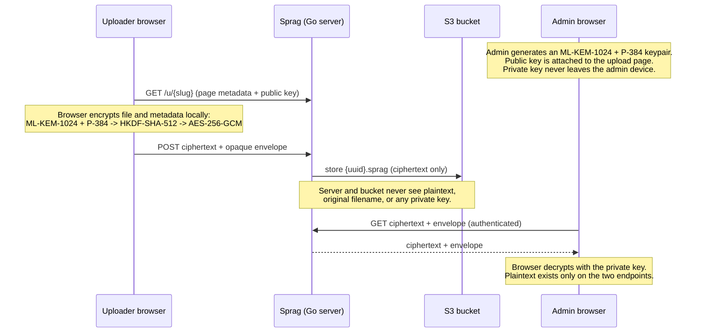

# Sprag

**A tiny, self-hostable, server-blind secure intake box.**
One Go binary. Anonymous uploads. Post-quantum end-to-end encryption. Nothing flows back out.

[](LICENSE.md)
[](go.mod)
[](INSTALL.md)
[](#server-blind-post-quantum-e2e-intake)

---

Sprag is named after a sprag clutch: it engages in one direction and freewheels in the other. The product has the same shape for files. Uploaders push files into an unguessable upload-page URL — they can never list, download, or even see what else has arrived. Only the authenticated admin can read what came in.

It is **not** a file-sharing product. It is an **asymmetric, anonymous intake box**: the admin creates a capability URL, hands it out, and someone on the other side drops files in. That is the whole shape of the product, and everything else is built to keep that shape small and legible.

With **server-blind E2E intake** enabled, the uploader's browser encrypts every file with **post-quantum hybrid cryptography** *before a single byte leaves the device*. The Go server and your S3 bucket only ever touch ciphertext. The admin decrypts client-side at download time. There is no plaintext for the server — or anyone who compromises it — to read.

> A SecureDrop-adjacent intake capability without SecureDrop's operational weight: optional Tor onion ingress, but no hardened workstation, no source accounts, no air-gapped review workflow, and no multi-server deployment requirement.

For deployment recipes, see [INSTALL.md](INSTALL.md). It covers plaintext intake, server-blind E2E intake, and onion-only Tor deployment.

## Who it's for

- **Lawyers** receiving privileged or sensitive client documents
- **Journalists** receiving source material and leaks
- **HR / compliance teams** running whistleblower channels
- **Doctors and researchers** collecting sensitive records
- **Anyone** who needs to collect files from people who should not need an account

## Why Sprag

- **One-way by construction.** The uploader API surface is exactly three routes. There is no listing endpoint a sender can reach. Knowing one page's URL reveals nothing about any other page or the admin area.
- **No accounts for uploaders. Ever.** The unguessable URL *is* the capability. That same trusted channel also carries the page's public key, so server-blind encryption needs no separate PKI or key-exchange ceremony.
- **Server-blind, post-quantum E2E.** Optional per-deployment, optional or required per-page. ML-KEM-1024 + P-384 hybrid KEM, HKDF-SHA-512, AES-256-GCM — encrypted in the browser before upload.
- **Tiny and legible.** A single CGO-free Go binary with an embedded React frontend, one `.env`, one SQLite file, one S3 bucket. You can read the whole threat model in an afternoon.
- **Bounded memory at any file size.** Uploads stream straight into an S3 multipart upload and downloads stream straight back out. A 5 GB file never lands on local disk or fills RAM.
- **Optional onion-only ingress.** Sprag can run behind a Tor onion service with no public host ports, while keeping the product shape as one-way intake rather than a full whistleblower platform.

## How it works



Without E2E, Sprag is still a strict one-way intake box: streaming uploads to S3, unguessable slugs, optional PINs, and admin-only listing and download. E2E mode adds the server-blindness on top.

## How it compares

Most "send me a file" tools are **outbound** sharing products retrofitted for inbound use, and their servers can read your files in normal operation. Sprag is built the other way around: inbound-only intake is the *only* thing it does, which is exactly why server blindness fits naturally instead of being bolted on.

The category itself is not empty — self-hosted "reverse share" tools exist, and at least one already pairs anonymous upload with S3 storage. What none of them do is the structural thing: a persistent, self-hosted, S3-backed intake box where the operator's server *provably cannot read* what was uploaded, with post-quantum encryption of the stored file.

| Project | Intake model | Self-host / license | Client-side E2E of file | Post-quantum at rest | Footprint |
| --- | --- | --- | --- | --- | --- |
| **Sprag** | One-way anonymous, no uploader account | Yes, GPL-3.0 | Yes | **Yes** (ML-KEM-1024 + P-384 hybrid) | Tiny, single Go binary |
| Pingvin Share X | Reverse shares plus accounts | Yes, BSD-2-Clause | No | No | Medium (Node, Docker, optional ClamAV) |
| Sharry | Alias pages, anonymous upload to a user | Yes, GPL-3.0 | No | No | Medium (Scala/JVM) |
| Nextcloud File Drop | Public upload link into a folder, no account | Yes, AGPL-3.0 | No | No | Heavy (PHP plus database) |
| OnionShare (receive) | Anonymous inbound over Tor, no account | Yes, GPL-3.0 | Effectively, via Tor | No | Desktop/CLI, not a persistent service |
| SecureDrop | Anonymous whistleblower intake | Yes, AGPL-3.0 | No (server-side GPG; Tor plus air-gap) | No | Very heavy (dedicated hardware) |
| GlobaLeaks | Anonymous whistleblower intake | Yes, AGPL-3.0 | No (server-side; PQ only in TLS) | No (roadmap) | Light-to-medium (single server) |
| Bitwarden Send | One-way send link, sender account | Yes, AGPL/GPL | Yes | No | Medium / SaaS |
| Tresorit Send | One-way send link, no account | No (proprietary, SaaS) | Yes | Announced, not shipped | SaaS |
| Internxt Send | One-way send link, no account | Partial (MIT; self-host reportedly broken) | Yes | Partial (Kyber-512, storage only, lowest level) | SaaS |
| timvisee/send (Firefox Send fork) | One-way send link, no account | Yes, MPL-2.0 | Yes (AES-128) | No | Light (single container) |
| WeTransfer | Outbound send, no account | No (proprietary, SaaS) | No (provider holds keys) | No | SaaS |

**Tresorit** has publicly chosen the same ML-KEM-1024 hybrid design Sprag uses, but as of 2026 it is roadmap, not shipping, and not an anonymous-intake tool. **Internxt** genuinely ships some post-quantum encryption, but it is storage-only, Kyber-512 (NIST category 1, the lowest level), apparently not hybrid, and not confirmed for its Send product. **GlobaLeaks** runs live hybrid post-quantum TLS in transit but still stores submissions under classical encryption. The combination that is unique to Sprag is the intersection: one-way anonymous intake, no uploader account, client-side post-quantum E2E of the file, and a tiny self-hosted footprint.

Sprag deliberately does **not** try to be a Dropbox, a ticketing system, or a form builder. There are no folders, no comment threads, no multi-tenant sharing permissions. That restraint is the moat.

## Features

- **Unguessable upload pages** — 24-character base62 slugs from `crypto/rand`. A page has a title, optional description, optional PIN, optional expiry, optional per-page max file size, an optional allow-list of extensions, and an active flag.
- **Drag-and-drop uploads** with multi-file support and per-file progress (bytes + ETA).
- **Optional PIN** per page (bcrypt-hashed, rate-limited per slug+client identifier).
- **Submission envelopes** — files selected or dropped together share one immutable submission ID, so the admin can see which files arrived as one package.
- **Anonymous file-status receipts** — every submission gets an unguessable receipt URL. The sender sees only aggregate arrival facts and status: received, reviewed, rejected, or downloaded.
- **Admin dashboard** — create/edit/delete pages, list uploads grouped by submission, update file status, download a single file, or download a plaintext page as a streamed `.zip`.
- **QR codes and copy buttons** for sharing capability URLs.
- **Server-blind post-quantum E2E intake** (see below).
- **Chain-of-custody manifests** — export page metadata, submission IDs, stored-object SHA-512 hashes, upload/download timestamps, and handling events as JSON.
- **Legal hold / sealed mode** — seal a page after intake closes; later administrative actions remain possible but are recorded as post-seal events.
- **Metadata-minimized ingress** — store plaintext uploader IPs, deterministic HMAC identifiers, or no uploader IP at all for anonymous ingress such as Tor.
- **Onion-only Tor deployment** — publish Sprag as a v3 onion service with no host-published app or Caddy ports.
- **Single static binary** with the frontend embedded via `embed.FS`. Pure-Go SQLite means CGO-free builds and trivial cross-compilation.

## Admin Workflows

1. **Create an intake page.** Set public title/instructions, optional PIN, optional expiry, file size limit, extension allow-list, and E2E policy.
2. **Share the capability URL.** The page URL is the upload capability. QR and copy controls are built in.
3. **Receive submissions.** Uploads are grouped into immutable submission envelopes and can include a sender receipt URL.
4. **Track file status.** The admin can mark a submission received, reviewed, rejected, or downloaded. The public receipt page shows only that status and aggregate file counts/bytes.
5. **Download or decrypt.** Plaintext pages support direct download and streamed ZIP export. E2E pages download ciphertext and decrypt in the admin browser with the page private key.
6. **Export evidence.** Chain-of-custody manifests include stored-object SHA-512 hashes and handling events. In E2E mode the server-side hash is a ciphertext-object hash.
7. **Seal when intake closes.** Sealing a page closes public intake, prevents reopening or page deletion, and marks later handling as post-seal activity.

## Security model

- **No uploader-reachable listing.** The public surface is exactly `GET /api/u/:slug` (metadata), `POST /api/u/:slug/pin`, and `POST /api/u/:slug`. Upload responses never include other files.
- **Unguessable capability URLs.** At least 24 chars, base62, cryptographically random.
- **Admin password** hashed with bcrypt. Supply it as plaintext (`ADMIN_PASSWORD`) or — better — as a precomputed bcrypt hash (`ADMIN_PASSWORD_HASH`) so the plaintext never lives in your config. Passwords beyond bcrypt's 72-byte limit are handled via an internal SHA-256 prehash.
- **IP metadata policy.** By default Sprag stores uploader IPs as plaintext for compatibility. Set `IP_STORAGE_MODE=hmac-sha256` and `IP_HASH_SECRET` to store deterministic keyed HMAC-SHA-256 identifiers instead; startup rewrites existing plaintext uploader IPs in SQLite to `ip-hmac-sha256:v1:<digest>`.
- **Rate limiting.** Admin login 5/min/client identifier, PIN attempts 10/min per slug+client identifier, keyed on the real client IP or its HMAC identifier (see `TRUSTED_PROXY_HOPS`). With `ANONYMOUS_INGRESS=true`, Sprag stores no uploader IP metadata and uses one global admin-login bucket plus page-scoped PIN buckets.
- **Sessions.** Stateless HMAC-signed cookies, 7-day expiry, `HttpOnly` + `SameSite=Lax`. Cookies use the `Secure` attribute for HTTPS; `COOKIE_SECURE=auto` disables it only for localhost, loopback, and HTTP `.onion` origins where browsers would otherwise refuse to send the cookie.
- **CSRF.** Admin mutations require the `X-Sprag-CSRF` custom header in addition to the same-site cookie.
- **Streaming with hard caps.** The size limit is enforced by a counting reader while streaming; an oversized upload aborts the S3 multipart upload instead of trusting `Content-Length`. Files are never buffered whole in memory or on disk.
- **Path-safe storage.** S3 keys use server-generated UUID paths (`S3_PREFIX/<slug>/<uuid>/<filename>`); the original filename is metadata only, so a malicious name can't traverse or collide.
- **Downloads are always `Content-Disposition: attachment`**, never inline, so the bucket can't be used as an XSS host.
- **Secrets are never logged.** Startup echoes a redacted config.

## Installation

Use [INSTALL.md](INSTALL.md) for full setup instructions. It includes:

- plaintext intake with normal server-readable uploads
- server-blind post-quantum E2E intake
- onion-only Tor deployment
- local development and MinIO notes
- backup, restore, and troubleshooting checklists

Minimal Docker start:

```bash
cp .env.example .env
openssl rand -base64 32   # put this in SESSION_SECRET
docker compose run --build --rm sprag-app hash-password
# put the printed hash in ADMIN_PASSWORD_HASH, then fill BASE_URL and S3_*
docker compose up --build -d
```

For source-based setup, use `go run ./cmd/sprag hash-password` instead of the Docker hash command.

## Configuration

Sprag loads `.env` if present and then reads environment variables. Startup fails fast if required secrets or S3 values are missing. `ONION_BASE_URL` is a Docker Compose helper used by `docker-compose.tor.yml`; it is mapped to `BASE_URL` inside the app container.

| Variable | Required | Default | Notes |
|---|:---:|---|---|
| `PORT` | | `8080` | Listen port. |
| `BASE_URL` | Yes | | Used to build shareable `/u/<slug>` URLs. |
| `ONION_BASE_URL` | | | Compose-only helper for `docker-compose.tor.yml`; set to `http://<hostname>.onion` after Tor generates the hostname. |
| `COOKIE_SECURE` | | `auto` | Cookie `Secure` attribute policy: `auto`, `true`, or `false`. `auto` uses secure cookies for HTTPS and non-secure cookies only for localhost, loopback, and HTTP `.onion` origins. |
| `SESSION_SECRET` | Yes | | Base64; must decode to at least 32 bytes. Rotating it invalidates all sessions. |
| `ADMIN_USERNAME` | | `admin` | |
| `ADMIN_PASSWORD` | Yes* | | Plaintext, bcrypt-hashed in memory at boot. |
| `ADMIN_PASSWORD_HASH` | Yes* | | Precomputed bcrypt hash (preferred). Takes precedence over `ADMIN_PASSWORD`. |
| `IP_STORAGE_MODE` | | `plain` | `plain` stores resolved uploader IPs. `hmac-sha256` stores deterministic `ip-hmac-sha256:v1:` identifiers and rewrites existing plaintext uploader IPs at startup. |
| `IP_HASH_SECRET` | Yes* | | Base64; required only when `IP_STORAGE_MODE=hmac-sha256`; must decode to at least 32 bytes. Protect it: IPs are low-entropy, so the secret is what prevents offline enumeration. |
| `MAX_FILE_SIZE` | | `5368709120` (5 GiB) | Global default; per-page limits may only lower it. |
| `ALLOWED_EXT` | | *(any)* | Comma list, e.g. `pdf,png,zip`. A hard ceiling per-page lists may narrow but not widen. |
| `TRUSTED_PROXY_HOPS` | | `1` | Number of trusted proxies appending to `X-Forwarded-For`. `0` = directly exposed. |
| `ANONYMOUS_INGRESS` | | `false` | Set `true` for Tor/onion ingress. Sprag stores no uploader IP and uses global/page-scoped abuse buckets instead of apparent per-IP buckets. |
| `DB_PATH` | | `/data/sprag.db` | SQLite path (WAL mode; back up the whole directory). |
| `S3_ENDPOINT` | Yes | | S3-compatible endpoint. |
| `S3_REGION` | Yes | | |
| `S3_BUCKET` | Yes | | |
| `S3_ACCESS_KEY` | Yes | | |
| `S3_SECRET_KEY` | Yes | | |
| `S3_USE_PATH_STYLE` | | `false` | `true` for MinIO. |
| `S3_PREFIX` | | `pages/` | Key namespace inside the bucket. |
| `E2E_INTAKE_ENABLED` | | `false` | Enables server-blind E2E intake. |
| `E2E_INTAKE_REQUIRED` | | `false` | Rejects plaintext pages/uploads. Requires `E2E_INTAKE_ENABLED=true`. |
| `E2E_INTAKE_ALGORITHM` | | `ML-KEM-1024-P384-HKDF-SHA512-AES-256-GCM` | The only supported profile. |

\* Exactly one of `ADMIN_PASSWORD` / `ADMIN_PASSWORD_HASH` is required.

`MAX_FILE_SIZE` defaults to 5 GiB. Admin sessions are stateless signed cookies (7-day expiry). Rotating `SESSION_SECRET` invalidates every outstanding session immediately; changing only the admin password does not, so rotate the secret too if you need to force existing sessions to log out.

## Server-blind post-quantum E2E intake

When `E2E_INTAKE_ENABLED=true`, admins can create pages whose uploads are encrypted in the uploader's browser **before any bytes leave the device**. Set `E2E_INTAKE_REQUIRED=true` to reject plaintext pages and plaintext uploads entirely.

**How it works:**

1. The admin generates an encryption identity in the browser. The **public key** is attached to the upload page; the **private key** never touches the server.
2. The public key rides on the same unguessable capability URL the admin already shares — no separate PKI or key server.
3. The uploader's browser encrypts each file and its metadata locally and uploads only ciphertext.
4. The server stores page public keys and encrypted upload envelopes, but **never** stores E2E private keys.
5. The admin decrypts downloads client-side with the private key.

**The cryptographic profile** is `ML-KEM-1024-P384-HKDF-SHA512-AES-256-GCM`: the browser combines **ML-KEM-1024** (post-quantum KEM, via [`@noble/post-quantum`](https://github.com/paulmillr/noble-post-quantum)) with **P-384 ECDH** in a hybrid construction, derives **AES-256-GCM** keys with **HKDF-SHA-512**, encrypts file bytes and metadata locally, and uploads only ciphertext. The hybrid design means an attacker would have to break *both* a classical and a post-quantum primitive — and recorded ciphertext stays safe against future quantum "harvest now, decrypt later" attacks. Both the HKDF `info` and the AES-GCM additional data fold in the canonical envelope, so no envelope field can be swapped without breaking decryption. ML-KEM-1024 targets NIST security category 5, the highest level.

**Back up each generated private key.** If it is lost, the matching encrypted uploads **cannot be recovered** — not by you, not by anyone. The server is blind by design.

The admin UI can optionally store a generated private key encrypted in browser IndexedDB. The stored value is wrapped with a key derived from an admin-supplied passphrase via memory-hard Argon2id and sealed with AES-256-GCM; Sprag never saves the passphrase. This is safer than keeping an unencrypted downloaded key, but weaker than a password manager or offline backup, and still does not protect against a compromised admin-origin script after the key is unlocked.

**What server-blind does and does not protect against.** A trust product lives or dies on the precision of this claim, so state it plainly. Sprag's E2E mode protects you against the passive, at-rest adversary: a stolen S3 bucket, a compromised admin session, an honest-but-curious operator, a backup that walks out the door, a full server compromise after the fact. In every one of those, the attacker gets ciphertext and an opaque envelope and nothing else. The true line is *the operator cannot read stored uploads; a breach yields only ciphertext.* What it does **not** defend against is an actively malicious or compromised host at upload time: the encryption runs in JavaScript the server delivers, and the public key arrives over the same channel, so a host that deliberately serves modified code or swaps the key could defeat it. The admin sees the key fingerprint in the dashboard, but it is not yet surfaced on the upload page for a source to compare out of band. This is the same caveat that applies to Firefox Send and to webmail-based "E2E"; it is inherent to browser-delivered cryptography, not a flaw in the construction. There is also no forward secrecy — the recipient key is static, so a leaked private key exposes the whole historical bucket — and because E2E encryption happens in a single pass in the uploader's browser, keep E2E uploads to a few hundred megabytes for now. The line you must **not** read into Sprag is "zero-trust even against the host who runs it."

## Storage

Metadata is stored in SQLite at `DB_PATH`. The database runs in WAL mode with a busy timeout so concurrent uploads don't fail under lock contention; this creates `-wal` and `-shm` sidecar files next to `DB_PATH`, so back up the whole directory. File bodies are streamed to S3-compatible object storage under `S3_PREFIX/<slug>/<uuid>/<filename>`. In E2E mode the stored object is opaque ciphertext (a `.sprag` blob), the content type is forced to `application/octet-stream`, and the original filename lives only inside the encrypted envelope — never in the object key.

## Tech stack

- **Backend:** Go (stdlib `net/http` + `chi`), pure-Go SQLite (`modernc.org/sqlite`, CGO-free), AWS SDK v2 for any S3-compatible endpoint, `log/slog` JSON logging.
- **Frontend:** React + TypeScript + Vite + Tailwind CSS, built to `frontend/dist/` and embedded into the binary.
- **Crypto:** bcrypt for passwords/PINs; `@noble/post-quantum` (ML-KEM-1024) + WebCrypto (P-384 ECDH, HKDF-SHA-512, AES-256-GCM) for E2E; memory-hard Argon2id (`@noble/hashes`) for the optional in-browser private-key store.
- **Deployment:** multi-stage Dockerfile to `gcr.io/distroless/static`, `docker-compose.yml` with Caddy for automatic HTTPS, and `docker-compose.tor.yml` for onion-only Tor ingress.

## Development

```bash
go test ./...            # backend tests
cd frontend && npm test  # frontend tests (Vitest), including the E2E crypto round-trip
```

## License

Sprag is free software under the **GNU General Public License v3.0** (or later). See [LICENSE.md](LICENSE.md).
